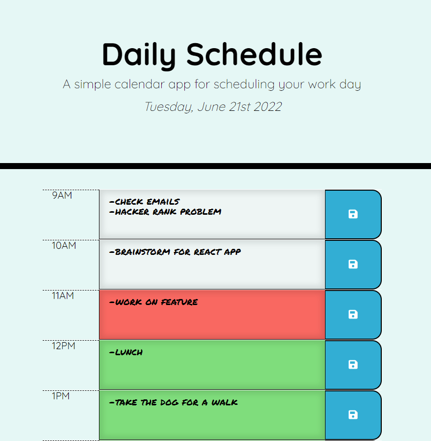

# Daily Schedule App

## Summary
A planner for each hour of the work day that uses local storage to save tasks.

## Description
This was an exercise in jQuery, Bootstrap, and moment.js to create a scheudler that responds to the hour of the day. Users can input their tasks directly into the text area and save them with the buttons on the right side of the screen.

Moment.js tracks the current time and uses that to add classes to corresponding text areas that change their colors. Past hours are grey, the current hour is red, and the future hours are green. Moment also records the current date and displays it at the top of the screen.

## Usage
This app is deployed using GitHub pages.

**Instructions**:
1. Click this [github pages link](https://sherb93.github.io/Password-Generator/).
2. Type your hourly tasks into the search bar and click the corresponding save icon.
3. If you close the app or refresh the page your tasks will be loaded in using local storage.

---

## ScreenShot:

